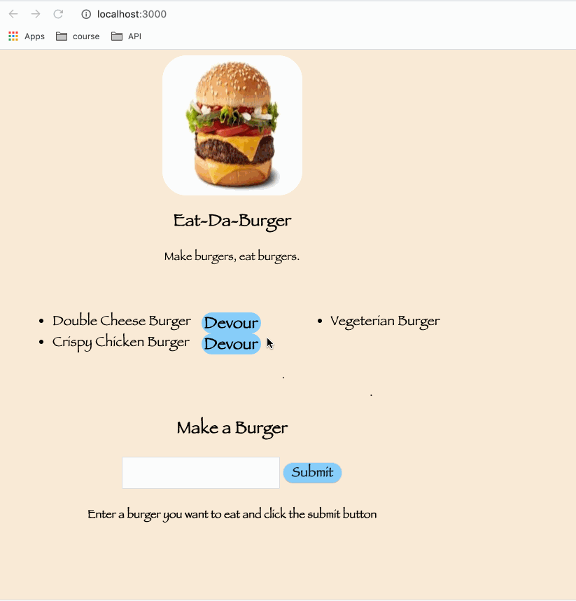

# burger

Technologies used:
1. node js
2. HTML
3. CSS
4. Express
5. MYSQL

This app will let you create your own burger and save that burger in the database and also have a option to devour. If you devour a burger then it will be place on the right side of the page while the created burger is placed on the left side of the page.

The directory for this assignment is as follows:
```
  Burger
    .
├── config
│   ├── connection.js
│   └── orm.js
│ 
├── controllers
│   └── burgers_controller.js
│
├── db
│   ├── schema.sql
│   └── seeds.sql
│
├── models
│   └── burger.js
│ 
├── node_modules
│ 
├── package.json
│
├── public
│   └── assets
│       ├── css
│       │   └── burger_style.css
│       └── img
│       |    └── burger.jpeg
│       |---js
│            |-- burgers.js
├── server.js
│
└── views
    ├── index.handlebars
    └── layouts
        └── main.handlebars
  ```
creating the burger and move to devour 

    <div id="notDevoured">
            <ul>
            {{#each burgers}}
                {{#unless devoured}}
                    <li>{{burger_name}} <div  class = "devour-class" data-id="{{id}}"> Devour</div></li>
                {{/unless}}
            {{/each}}
            </ul>
        </div>
        <div id="devoured">
            <ul>
            {{#each burgers}}
                {{#if devoured}}
                    <li>{{burger_name}}</li>
                {{/if}}
            {{/each}}
            </ul>
        </div>
